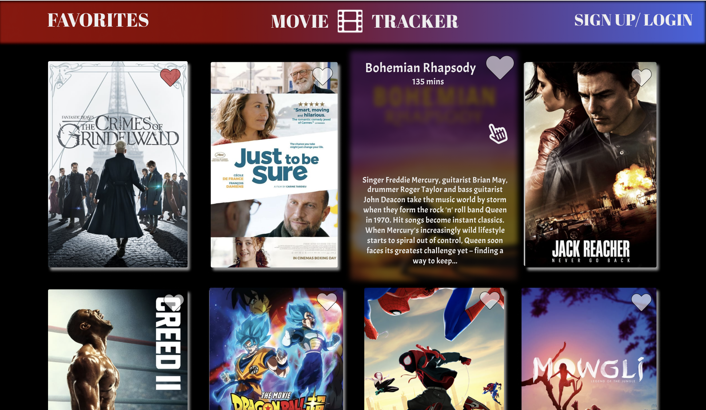
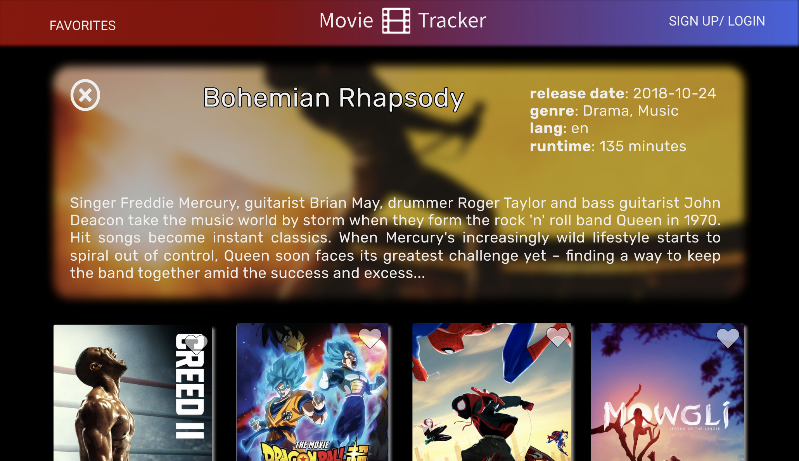

# Movie Tracker 

### Introduction

Movie Tracker is an application built using the [Movie Database API](https://developers.themoviedb.org/3/getting-started/introduction) in order to help it's personalized users browse, search for, as well as favorite/unfavorite any movie they come across.

This project was assigned to be completed in less than 5 days requiring communication between myself and two other team members. It was our first time utilizing a back end database and server to store and retrieve information.

### Demo

### Prerequisites

This application asumes that you have the following installed on your machine:

- [node](https://www.npmjs.com/get-npm)
- [npm](https://www.npmjs.com/get-npm)

### Setup

1. Fork this repository by clicking on the "Fork" button on the top-right of this page.

2. Open your terminal and navigate to the working directory (for instructions on how to navigate through your terminal see [here](https://ccrma.stanford.edu/guides/planetccrma/terminal.html)) you want your new directory to be located, and enter the following command:
`git clone https://github.com/YOUR_GITHUB_USERNAME_HERE/BFit_fe`

### Technologies used:
* React
* Redux
* React Router
* Redux-Thunk Middleware
* Jest
* Enzyme

#### Backend
To view this application, you first need to run the backend server by following these instructions:

* `git clone https://github.com/turingschool-examples/movie-tracker backend`
* `cd backend`
* `npm install`
* `npm start`

#### Frontend
Then, you can run the frontend server to view with the application

* `git clone https://github.com/colev1/movie-tracker`
* `cd movie-tracker/`
* `npm install`
* `npm start`

Open [http://localhost:3000](http://localhost:3000) to view it in the browser.

### Testing
In the movie-tracker directory, you can run the test files using:
`npm test`

### Built With

### Setup:
This project was bootstrapped with [Create React App](https://github.com/facebook/create-react-app).

### Design and Layout

##### Wireframe:

#### Contributors
* Cole Vanacore: https://github.com/colev1
* Kylie Stanley: https://github.com/kyliestanley
* Cody Price: https://github.com/cody-price

